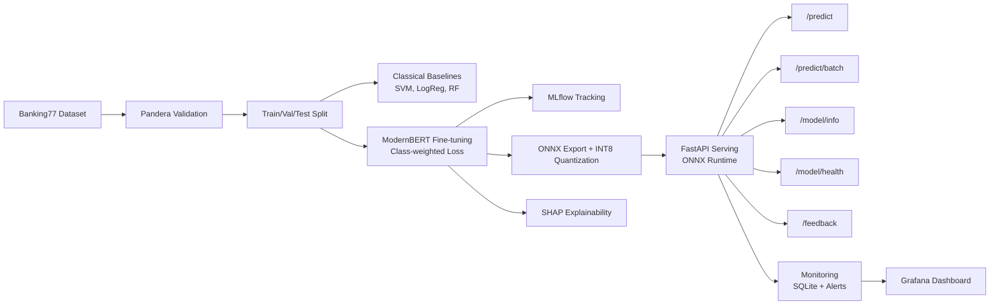

# AreteusML


ML pipeline for Banking77 intent classification, from data validation through ONNX-optimized serving. Fine-tunes ModernBERT-base on 77 banking intent classes (13,083 samples) with class-weighted loss, exports to ONNX INT8 for about 10 ms per request on CPU (10.11 ms mean over 100 samples; PyTorch 45.66 ms), and serves predictions through a FastAPI REST API.

## Key Results

| Model | Accuracy | F1 Macro | Inference Latency |
|-------|----------|----------|-------------------|
| **ModernBERT-base (fine-tuned)** | **91.3%** | **91.4%** | 45.66ms (PyTorch) |
| ONNX FP32 | -- | -- | 19.86ms (2.3x faster) |
| **ONNX INT8 (served)** | -- | -- | **10.11ms (4.52x faster)** |
| SVM baseline | 87.9% | -- | -- |
| Logistic Regression baseline | 84.5% | -- | -- |
| Random Forest baseline | 83.9% | -- | -- |

## Architecture


```mermaid
graph LR
    A[Banking77 Dataset] --> B[Pandera Validation]
    B --> C[Train/Val/Test Split]
    C --> D[Classical Baselines<br>SVM, LogReg, RF]
    C --> E[ModernBERT Fine-tuning<br>Class-weighted Loss]
    E --> F[MLflow Tracking]
    E --> G[ONNX Export + INT8 Quantization]
    G --> H[FastAPI Serving<br>ONNX Runtime]
    H --> I["/predict"]
    H --> J["/predict/batch"]
    H --> K["/model/info"]
    H --> L["/model/health"]
    H --> P["/feedback"]
    E --> M[SHAP Explainability]
    H --> N[Monitoring<br>SQLite + Alerts]
    N --> O[Grafana Dashboard]
```

## Project Structure

```
areteusml/
├── ml/
│   ├── data/            # Data loading, splitting, processed outputs
│   ├── validation/      # Pandera schemas for data validation
│   ├── training/        # train.py, train_baseline.py, evaluate.py, hyperparameter_search.py
│   ├── models/          # Saved models (production/, onnx/)
│   ├── pipelines/       # Dagster pipeline definitions
│   ├── explainability/  # SHAP analysis
│   ├── utils/           # Reproducibility, seed management
│   └── tests/           # ML unit tests
├── backend/
│   └── app/
│       ├── api/routes/  # predict, model, admin, feedback endpoints
│       ├── core/        # Model loader, cache, security
│       ├── services/    # Inference, audit logging
│       └── middleware/  # Rate limiting, security headers
├── dashboard/           # Streamlit dashboard (5 pages)
├── monitoring/          # Performance tracking, alerts, drift detection
├── infrastructure/      # Prometheus, Grafana configs
├── artifacts/           # Training metrics, plots, confusion matrices
├── notebooks/           # EDA and analysis notebooks
├── scripts/             # Drift reports, prediction generation, run_all
├── docs/                # Project walkthrough and decision records
├── Makefile             # install, dev, lint, test, train, serve, docker targets
├── docker-compose.yml   # Full stack: API, Redis, Dashboard, Prometheus, Grafana
└── pyproject.toml
```

## Quick Start

### Install

```bash
# Requires Python 3.12 and uv
uv sync
```

### Download and Prepare Data

```bash
python -m ml.data.load_data
```

Downloads Banking77 from HuggingFace and creates train/val/test splits in `ml/data/processed/`.

### Train Classical Baselines

```bash
python -m ml.training.train_baseline
```

Trains SVM, Logistic Regression, and Random Forest with TF-IDF features. Results logged to MLflow.

### Fine-tune ModernBERT

```bash
python -m ml.training.train
```

Fine-tunes `answerdotai/ModernBERT-base` with class-weighted cross-entropy loss. Runs on a CUDA GPU with as little as 6GB VRAM thanks to gradient checkpointing, a batch size of 2 with gradient accumulation, and the memory-efficient Adafactor optimizer (trained on the Kaggle T4 free tier); more VRAM just lets you raise the batch size and train faster. Model saved to `ml/models/production/`, metrics to `artifacts/modernbert/`.

### Export to ONNX

```bash
python -m ml.training.export_onnx
```

Exports to ONNX format with INT8 dynamic quantization. Output in `ml/models/onnx/`.

### Serve

```bash
uvicorn backend.app.main:app --host 0.0.0.0 --port 8000
```

## API Usage

### Single Prediction

```bash
curl -X POST http://localhost:8000/predict \
  -H "Content-Type: application/json" \
  -d '{"text": "I want to know when my card will arrive"}'
```

```json
{
  "label": 7,
  "confidence": 0.94,
  "label_name": "card_arrival",
  "prediction_id": "a1b2c3d4e5f6...",
  "latency_ms": 8.7,
  "low_confidence": false,
  "message": null
}
```

### Batch Prediction

```bash
curl -X POST http://localhost:8000/predict/batch \
  -H "Content-Type: application/json" \
  -d '{"texts": ["How do I top up?", "My transfer failed", "What are the fees?"]}'
```

### Model Info

```bash
curl http://localhost:8000/model/info
```

### Health Check

```bash
curl http://localhost:8000/model/health
```

### Submit Feedback

```bash
curl -X POST http://localhost:8000/feedback \
  -H "Content-Type: application/json" \
  -d '{"prediction_id": "abc123", "correct_label": 5, "correct_label_name": "card_arrival"}'
```

## Docker Deployment

```bash
docker compose up --build
```

| Service | URL | Description |
|---------|-----|-------------|
| API | http://localhost:8000 | FastAPI prediction service |
| Redis | localhost:6379 | Prediction caching |
| Dashboard | http://localhost:8501 | Streamlit analytics dashboard |
| Prometheus | http://localhost:9090 | Metrics collection |
| Grafana | http://localhost:3000 | Monitoring dashboards (admin/admin) |

## Training Details

| Hyperparameter | Value |
|----------------|-------|
| Base model | `answerdotai/ModernBERT-base` |
| Max sequence length | 64 tokens |
| Learning rate | 2e-5 |
| Epochs | 10 (with early stopping) |
| Early stopping patience | 3 |
| Optimizer | Adafactor |
| Weight decay | 0.01 |
| Warmup ratio | 0.1 |
| FP16 training | Yes |
| Gradient checkpointing | Yes |
| Seed | 42 |

**Class-weighted cross-entropy:** Computes per-class weights via `sklearn.utils.class_weight.compute_class_weight` to handle imbalance across the 77 intent categories. Weights are passed to `torch.nn.CrossEntropyLoss` through a custom `WeightedTrainer` subclass.

**Early stopping:** Monitors validation F1 macro with patience of 3 epochs. Best checkpoint is restored automatically.

**Gradient checkpointing:** Enabled to reduce VRAM usage, making fine-tuning feasible on 6GB GPUs.

## ONNX Export and Benchmarks

The trained PyTorch model is exported to ONNX and quantized to INT8 using dynamic quantization via ONNX Runtime.

| Format | Model size | Latency (avg, 100 samples) | Speedup |
|--------|-----------|----------------------------|---------|
| PyTorch FP32 | 571 MB | 45.66ms | 1.0x |
| ONNX FP32 | 577 MB | 19.86ms | 2.3x |
| **ONNX INT8** | **146 MB** | **10.11ms** | **4.52x** |

The API serves the INT8 model. I did not re-score the test split through the INT8 model, so the accuracy and F1 above are for the PyTorch model and the INT8 accuracy is unmeasured.

The latencies are CPU wall-clock means over 100 test-split texts, one request at a time, measured once on one machine. `python -m ml.training.export_onnx` re-runs the export and the benchmark and writes `ml/models/onnx/benchmark_results.json`. It needs the fine-tuned model in `ml/models/production/`, which `python -m ml.training.train` produces. The `artifacts/` and `data/` folders are tracked with DVC, but the DVC remote is a local folder on my own machine, so `dvc pull` only works there.

### What broke

ONNX export of ModernBERT failed through `optimum` (LayerNorm), so the export calls `torch.onnx.export` directly with opset 18. INT8 quantization then failed on the exported graph until I cleared its `value_info` entries, because the stale shape information broke shape inference. Details are in `docs/PROJECT_WALKTHROUGH.md`.

## Tech Stack

| Category | Tools |
|----------|-------|
| ML Framework | PyTorch, HuggingFace Transformers, scikit-learn |
| Model | ModernBERT-base (encoder-only transformer, Dec 2024) |
| Inference | ONNX Runtime, INT8 dynamic quantization |
| API | FastAPI, Pydantic, uvicorn |
| Data Validation | Pandera |
| Experiment Tracking | MLflow |
| Explainability | SHAP |
| Hyperparameter Search | Optuna |
| Package Management | uv |
| Monitoring | Prometheus, Grafana, SQLite (metrics), AlertManager |
| Orchestration | Dagster |
| Dashboard | Streamlit, Plotly |
| Data Versioning | DVC |
| Containerization | Docker, Docker Compose |
| Linting | Ruff |
| Testing | pytest (91 collected; 86 pass with `-m "not slow and not gpu"`, 5 skipped) |
| CI | GitHub Actions: ruff, pytest with coverage, pip-audit (no deploy workflow) |
